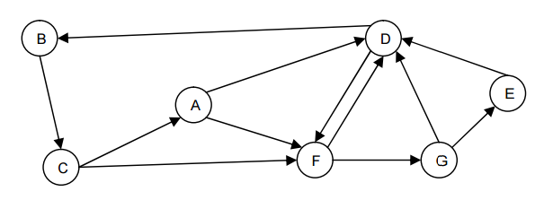

1. Sin desarrollar un programa, determinar en el siguiente digrafo:

a) grados de entrada y salida de cada vértice.

|V|Entrada |Salida | 
|-|--------|-------|
|A|1       |2      |
|B|1       |1      |
|C|1       |2      |
|D|4       |2      |
|E|1       |1      |
|F|3       |2      |
|G|1       |1      |

b) todos los ciclos que pasan por el vértice C

- `CADBC`
- `CFDBC`
- `CAFDBC`
- `CFGDBC`
- `CAFGDBC`
- `CFGEDBC`
- `CAFGEDBC`

c) todos los caminos del vértice A al E

- `AFGE`
- `ADFGE`

d) todos los caminos del vértice B al D

- `BCAD`
- `BCFD`
- `BCAFD`
- `BCFGD`
- `BCAFGD`
- `BCFGED`
- `BCAFGED`

e) todos los caminos de longitud 4 con origen en el vértice A

- `ADFDF`
- `ADFDB`
- `ADFGD`
- `ADFGE`
- `ADBCF`
- `ADBCA`
- `AFDBC`
- `AFDFG`
- `AFDFD`
- `AFGDF`
- `AFGDB`
- `AFGED`

f) la matriz de adyacencia que lo representa.

| |A|B|C|D|E|F|G|
|-|-|-|-|-|-|-|-|
|A|0|0|0|1|0|1|0|
|B|0|0|1|0|0|0|0|
|C|1|0|0|0|0|1|0|
|D|0|1|0|0|0|1|0|
|E|0|0|0|1|0|0|0|
|F|0|0|0|1|0|0|1|
|G|0|0|0|1|1|0|0| 

g) la lista de adyacencia que lo representa.

[(AD), (AF), (BC), (CA), (CF), (DB), (DF), (ED), (FD), (FG), (GD), (GD), (GE)]

h) la matriz de adyacencia que lo representa, suponiendo que no es un grafo dirigido. 

| |A|B|C|D|E|F|G|
|-|-|-|-|-|-|-|-|
|A|0|0|1|1|0|1|0|
|B|0|0|1|1|0|0|0|
|C|1|1|0|0|0|1|0|
|D|1|1|0|0|1|1|1|
|E|0|0|0|1|0|0|1|
|F|1|0|1|1|0|0|1|
|G|0|0|0|1|1|1|0| 
