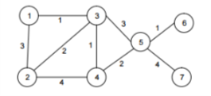

9. Para el siguiente grafo (sin desarrollar programa):

a) mostrar el contenido de todos sus vértices utilizando recorrido en profundidad partiendo
del vértice 1

`1234567`

b) mostrar el contenido de todos sus vértices utilizando recorrido en amplitud partiendo del
vértice 1

`1234567`

c) mostrar el contenido de todos sus vértices utilizando recorrido en profundidad partiendo
del vértice 5

`312467`

d) mostrar el contenido de todos sus vértices utilizando recorrido en amplitud partiendo del
vértice 5

`5346721`

